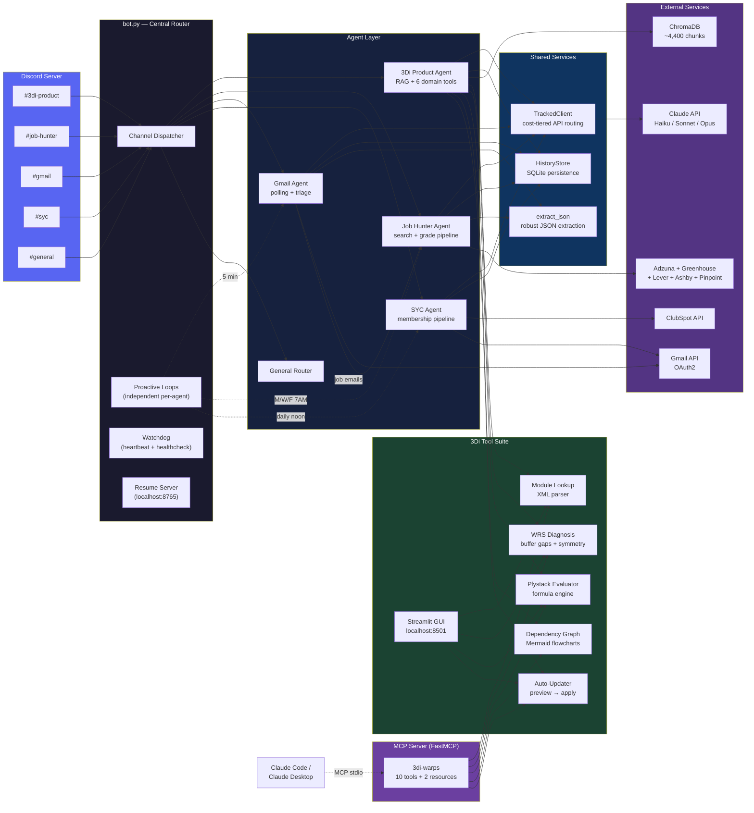

# AgentHub

AgentHub is a production multi-agent platform I built and run 24/7 — five specialized Claude agents handling domain RAG over proprietary industrial software, job market intelligence, email triage, membership pipeline automation, and cross-agent orchestration. It runs on a dedicated server with process-level locking, independent proactive loops, cost-tracked API routing, and SQLite-backed conversation persistence.

This is a portfolio showcase, not the full codebase. The production system integrates with proprietary employer systems and third-party credentials that can't be open-sourced. What's here: the architecture, the engineering patterns, and selected code excerpts that demonstrate how the system works.

## Architecture

## What It Does

- **Domain RAG Agent** — Answers technical questions about a proprietary manufacturing execution system (MES) by querying a ChromaDB knowledge base (4,400+ chunks from XML modules, C# source, Excel specs, and markdown documentation). Beyond RAG, the agent exposes 6 callable tools: module lookup (full XML vocabulary parser), WRS diagnosis (buffer gap analysis, ply symmetry checks), plystack evaluation (recursive-descent formula engine that resolves the full Warps expression language), dependency graphing (Mermaid flowcharts across 264 module files), and a two-step auto-updater (preview diff → apply with backup). All tools also accessible via a Streamlit GUI for non-Discord use. The unusual part: I'm both the AI builder and the domain expert for the proprietary system the AI runs on top of.

- **Job Hunter Agent** — Automated pipeline that discovers, scores, and filters 300+ job postings per run across 32 target companies and 5 job platforms (Adzuna, Greenhouse, Lever, Ashby, Pinpoint). Two-pass LLM grading: Haiku fast-grades every job (~$0.01/job), Opus deep-grades top scorers. Calibrated 5-axis scoring rubric with 10 anchor examples. 3x/week email digest. Companion Firefox extension for on-demand grading.

- **Gmail Agent** — Polls personal inbox every 5 minutes. Detects job notification emails (LinkedIn, Indeed, ZipRecruiter, recruiter outreach) by sender/subject patterns, extracts job details via Claude, and forwards them to the Job Hunter agent for grading. Results auto-post to the job-hunter Discord channel.

- **SYC Membership Agent** — Automates a nonprofit's membership pipeline: email classification (Haiku), auto-replies with application materials, PDF application extraction (Sonnet vision), applicant tracking via Google Sheets, and ClubSpot CRM sync.

- **General Router** — Handles cross-agent queries and routes unmatched messages.

## Why This Exists

I'm an Engineering Program Manager who owns the manufacturing execution system for a $125M composite manufacturing product line. In late 2025, I started building AI tools to automate parts of my workflow. That turned into AgentHub — a system that now runs continuously, handles real production tasks, and taught me more about AI systems engineering than any course could.

The interesting engineering problems weren't the Claude API calls. They were:
- **Ingesting an undocumented proprietary system** into a queryable knowledge base (4,400 chunks from XML, C#, Excel, and markdown with no existing documentation)
- **Cost management** across three model tiers when you're running hundreds of API calls per day
- **Process discipline** for a system that runs 24/7 on commodity hardware (process locking, independent proactive loops with timeouts, heartbeat monitoring, graceful error handling)
- **Cross-agent coordination** without tight coupling (Gmail agent detects job emails and hands them to Job Hunter, but neither agent imports the other's internals)

## Engineering Patterns

The [`examples/`](examples/) directory contains selected code excerpts from the production system. These are real, running code — not simplified demos.

### Cost-Tiered API Routing — [`tracked_client.py`](examples/tracked_client.py)

Drop-in replacement for the Anthropic client that wraps every API call with token counting and cost estimation. Accumulates totals across the bot's lifetime. The bot exposes a `!costs` command that reads from this tracker.

The design choice: wrapping at the client level (not the agent level) means every API call is tracked regardless of which agent makes it, including one-off calls in the general router or the email classifier. No agent needs to know tracking exists.

### Base Agent with Tool-Use Loop — [`base_agent.py`](examples/base_agent.py)

All five agents inherit from this base class, which handles:
- Multi-round tool-use loops (Claude calls a tool, gets the result, decides whether to call another)
- Per-user conversation history with automatic SQLite persistence
- Configurable tool definitions (subclasses just define `tools` and `execute_tool()`)
- Safety limits on tool-use rounds to prevent runaway loops

### SQLite Conversation Persistence — [`history_store.py`](examples/history_store.py)

Conversations survive bot restarts. The tricky part is serialization — conversation history contains a mix of plain strings, tool-result dicts, and Pydantic `ContentBlock` objects from the Anthropic SDK. The serializer handles all three without losing type information that Claude needs on the next turn.

### Robust JSON Extraction — [`utils.py`](examples/utils.py)

Claude's responses aren't always clean JSON even when you ask for it. This extractor handles markdown fences, preamble text, and partial formatting. It runs on every job grading response (hundreds per week) and on every email classification. The fallback chain: strip fences → try raw parse → regex for `{...}` or `[...]` blocks.

### Channel-to-Agent Dispatcher — [`channel_router.py`](examples/channel_router.py)

The Discord bot routes messages by channel ID, not by command prefix or message content. Each channel maps to exactly one agent. The routing is config-driven — `!setup` links any channel to any agent at runtime. This excerpt also shows the message-splitting logic for Discord's 2000-char limit and the cross-agent wiring (Gmail → Job Hunter).

### Independent Proactive Loops — [`proactive_loops.py`](examples/proactive_loops.py)

Each agent has its own proactive notification loop with independent timing and a 120-second timeout. A hung Gmail API call doesn't block the Job Hunter's scheduled run. This replaced an earlier design where all agents shared a single sequential loop — one slow agent would delay all the others.

### MCP Server — [`mcp_3di_server.py`](examples/mcp_3di_server.py)

Instead of building a chatbot that *contains* Claude, this gives Claude direct access to the domain tools via the Model Context Protocol. The MCP server wraps all 10 analysis tools as callable endpoints — Claude Code or Claude Desktop connects over stdio and can call `evaluate_plystack`, `analyze_wrs`, `module_dependencies`, etc. alongside its own reasoning. This means you can drag in 8 raw .wrs files, ask "why is the scarf behaving wrong?", and Claude can both reason about the XML and call the plystack evaluator in the same conversation. The server also exposes domain reference documents as MCP resources.

### Process-Level Locking — [`process_lock.py`](examples/process_lock.py)

The bot runs on an always-on machine with auto-start via Windows Task Scheduler. The lock mechanism scans all running Python processes for other `bot.py` instances before starting. Combined with a hostname guard (the bot only runs on one specific machine), this prevents duplicate instances from OneDrive sync or accidental launches.

## Technology Stack

| Layer | Tool |
|-------|------|
| Language | Python 3.10 |
| Discord | discord.py |
| AI | Claude API via Anthropic SDK (Haiku, Sonnet, Opus) |
| RAG | ChromaDB + sentence-transformers (all-MiniLM-L6-v2) |
| Domain Tools | FastMCP (MCP server), Streamlit (GUI), recursive-descent expression evaluator, XML parser |
| Email | Google Gmail API (OAuth2) |
| Job Platforms | Adzuna, Greenhouse, Lever, Ashby, Pinpoint |
| CRM | ClubSpot API |
| Persistence | SQLite (conversations), JSON (job data, knowledge gaps) |
| Monitoring | Heartbeat file + optional HTTP healthcheck |

## Production Discipline

This runs 24/7 on dedicated hardware (ThinkPad, 8GB RAM, Windows 10 Pro). That constraint shaped every decision:

- **No local ML inference.** Agents call the Claude API. All compute stays on Anthropic's side.
- **Cost tiers matter.** Haiku for high-volume classification and grading (~$0.01/job). Sonnet for conversations and vision tasks. Opus only for deep analysis that justifies the 5x cost premium. TrackedClient logs every call.
- **Process isolation.** Machine-level hostname guard, process-scan lock, PID file. The bot auto-starts on boot and only one instance runs at a time.
- **Independent failure domains.** Each agent's proactive loop runs on its own timer with its own timeout. An API timeout in one agent doesn't cascade.
- **Persistence by default.** Conversations survive restarts. Job dedup state persists for 90 days. Knowledge gaps accumulate and get reviewed weekly.

## What's Not Here

- **Proprietary domain content.** The RAG agent is built on top of a closed, undocumented manufacturing system. The ingestion pipeline, embedding strategy, and reconciliation logic are shown. The actual source data, domain-specific system prompt, and embedded chunks are not.
- **Credentials and tokens.** All secrets live in `.env` (gitignored). OAuth tokens, API keys, and Discord bot tokens are never committed.
- **Full agent implementations.** The production agents contain employer-specific logic, email templates, and pipeline integrations that can't be shared. The base class and shared utilities shown here are representative of the engineering patterns.

## About Me

**Brodt Taylor** — Engineering Program Manager at North Sails. I own the manufacturing execution system for the company's $125M 3Di composite product line, lead 8 engineers across two countries, and serve as primary technical liaison to the CEO and COO. I built AgentHub to solve real problems in my workflow and have been running it in production since early 2026.

I'm looking for roles where manufacturing/operations leadership and hands-on AI building both create value — FDE, Solutions Architect, Applied AI Engineer, TPM, or founding engineer at companies deploying AI into physical operations.

[LinkedIn](https://www.linkedin.com/in/brodttaylor/) | brodttaylor@gmail.com
